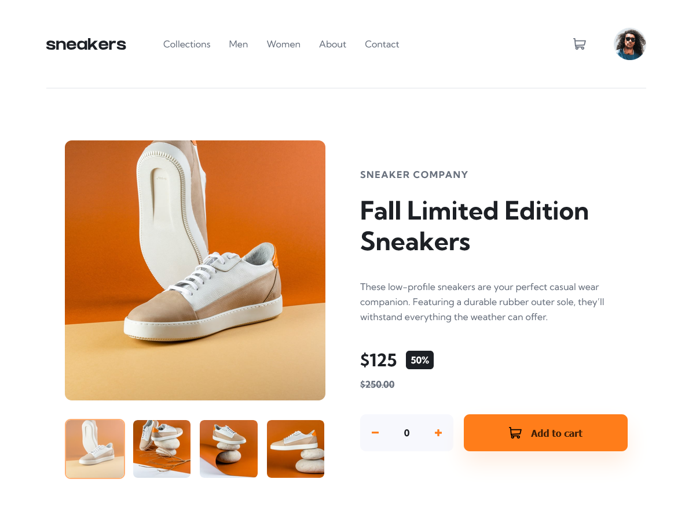
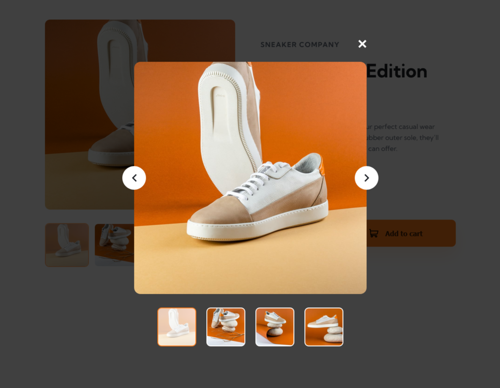

# Frontend Mentor - E-Commerce Product Page Solution

This is a solution to the [E-Commerce Product Page challenge on Frontend Mentor](https://www.frontendmentor.io/challenges/ecommerce-product-page-UP7a7REoG). Frontend Mentor challenges help you improve your coding skills by building realistic projects.

## Table of contents

- [Overview](#overview)
  - [The challenge](#the-challenge)
  - [Screenshot](#screenshot)
  - [Links](#links)
- [My process](#my-process)
  - [Built with](#built-with)
  - [What I learned](#what-i-learned)
- [Author](#author)

## Overview

### The challenge

Users should be able to:

- View the optimal layout for the site depending on their device's screen size
- See hover states for all interactive elements on the page
- Open a lightbox gallery by clicking on the large product image
- Switch the large product image by clicking on the small thumbnail images
- Add items to the cart
- View the cart and remove items from it

### Screenshots

<div style="display: flex; align-items: center; justify-content: space-between;">
  
  
</div>

### Links

- [Solution URL](https://github.com/Kking927/ecommerce-product-page)
- [Live Site URL](https://kking927.github.io/ecommerce-product-page/)

## My process

### Built with

- Semantic HTML5 markup
- CSS Custom Properties
- Flexbox
- Mobile-first workflow
- Vanilla JavaScript

### What I learned

During this project, I focused on creating an interactive product gallery, handling both responsive image switching between layouts and synchronous full-image-to-thumbnail state changes.

Here are the implementation highlights I'm proud of:

1. **Synchronized Thumbnail and Main Image Swapping:**
   I used data attributes on the thumbnail buttons to dynamically update the source of the main product feature image. By leveraging a consistent naming structure for the image files, the JavaScript updates the target layout seamlessly on click.

   ```js
   const thumbnails = document.querySelectorAll('.thumbnail-btn');
   const mainProductImg = document.querySelector('.main-product-image');

   thumbnails.forEach((thumbnail) => {
     thumbnail.addEventListener('click', (e) => {
       // Remove active state from all thumbnails and apply to the clicked one
       thumbnails.forEach(btn => btn.classList.remove('active'));
       e.currentTarget.classList.add('active');

       // Grab the target image number from the data attribute
       const imageIndex = e.currentTarget.dataset.imgIndex;
       
       // Update the main feature image path dynamically
       mainProductImg.src = `./images/image-product-${imageIndex}.jpg`;
     });
   });
   ```

2. **Responsive Source Handling for Desktop vs. Mobile:**
Instead of using JavaScript to switch images when the screen resizes, I used the HTML `<picture>` tag with media queries to load the correct mobile or desktop image.

    ```html
    <picture class="product-gallery-view">
      <source media="(min-width: 768px)" srcset="./images/image-product-1.jpg">
      
    </picture>
    ```

## Author

- Frontend Mentor - [@Kking927](https://www.frontendmentor.io/profile/Kking927)
